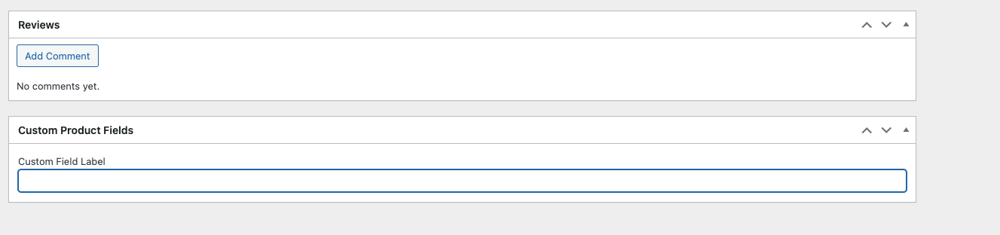

# Custom Product Fields for WooCommerce

A WordPress plugin that adds custom fields to WooCommerce products, displays them on the product page, and includes them in the WooCommerce REST API response.

## Features
- Add custom fields to WooCommerce products in the WordPress admin panel.
- Display custom field values on the single product page.
- Extend the WooCommerce REST API to include custom field data.

## Requirements
- WordPress 5.0 or higher
- WooCommerce 5.0 or higher
- PHP 7.4 or higher

## Installation
1. Download the plugin files or clone the repository.
2. Upload the plugin folder to the `/wp-content/plugins/` directory.
3. Activate the plugin through the 'Plugins' menu in WordPress.

## Usage
1. Go to any product edit screen in the WordPress admin panel.
2. Add a value to the **Custom Product Field** under the "Custom Product Fields" meta box.
3. Save or update the product.
4. View the custom field value on the single product page under the product summary section.
